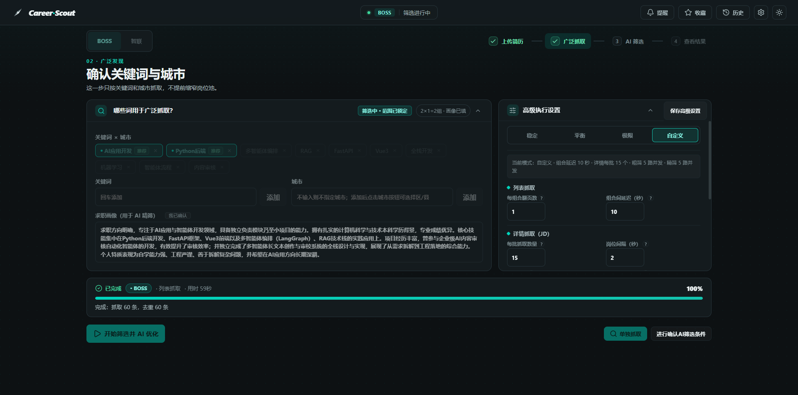
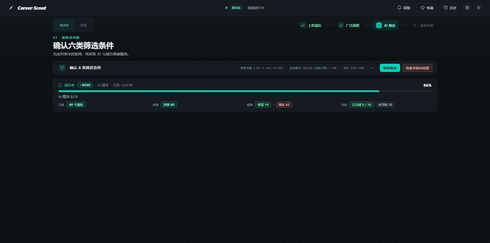
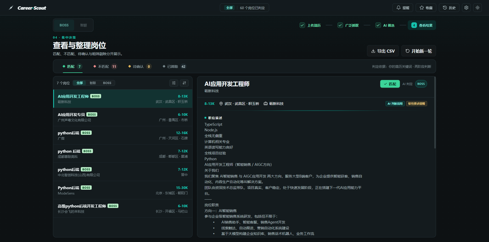

# Career Scout v1.8.1 · BOSS直聘 & 智联招聘职位助手

Career Scout 是一个基于 Chrome DevTools Protocol（CDP）的多平台职位搜索与求职工具，目前支持 **BOSS 直聘** 和 **智联招聘**。它连接你本机已经登录的 Chrome，复用真实登录态抓取职位列表与 JD 详情，并通过本地 Web 工作台完成简历驱动的两层筛选、AI 语义评估、岗位生命周期管理和投递过期提醒。

所有数据默认保存在本机 `~/.career-scout`，AI Key 存入系统凭据库，不会写入项目文件或日志。

## 界面预览

### 三步完成一次岗位筛选

1. **确认关键词与城市**：输入关键词、选择城市，调整列表/JD 抓取与 AI 筛选参数。

   

2. **确认筛选条件**：七类筛选条件对照简历画像进行粗筛与 AI 精筛；第 7 类「招聘者上次活跃」为单选档位（近一周/近一个月/近三个月/近半年），招聘者上次活跃超过所选档位的岗位自动判为不匹配，拿不到活跃数据的岗位标注未知且不拦截。

   

3. **查看与整理岗位**：匹配、不匹配、待确认与已筛除分开展示，逐条决策。

   

## 免责声明

使用前请阅读 [BOSS直聘用户协议](https://www.zhipin.com/about/protocol.html)、智联招聘相关服务条款及相关法律法规，不要用于商业转售、恶意爬取或对目标网站造成负担。使用本项目产生的一切后果由使用者自行承担。

## 桌面版

Windows 与 macOS 用户可直接使用桌面版，无需安装 Python 或 Node.js：

- 最新正式版：v1.8.1
- Windows 安装包：`CareerScout-v1.8.1.exe`，下载后双击运行
- macOS 安装包：`CareerScout-v1.8.1.dmg`，首次打开见下方 Gatekeeper 说明
- 应用内更新（桌面版）：启动时自动检查新版本，可一键下载、校验并重启完成更新；检查与下载优先走国内自建更新镜像（直连可达），镜像不可达时自动回退 GitHub，安装包均经 SHA256 校验后才替换

### 首次运行准备

- **浏览器**：支持 Chrome、Edge 及其他 Chromium 内核浏览器（Brave、Vivaldi、Opera、360 极速、QQ 浏览器、夸克等），可在应用「设置 → 浏览器与账号」中自动探测选择，或手动指定可执行文件路径；桌面版使用独立的专用浏览器 profile，不复制主浏览器 Cookie。首次使用请在专用 Chrome/浏览器账号中完成一次 BOSS 直聘 / 智联招聘登录，登录态会持久化保存。登录方式与源码版一致，见下方“启动专用 Chrome 并登录”与“浏览器账号”说明。
- **Windows WebView2**：Windows 11 预装 WebView2；Windows 10 如果缺失，桌面版可能无法显示界面，请到 Microsoft 官方页面安装 WebView2 运行时（[developer.microsoft.com/microsoft-edge/webview2](https://developer.microsoft.com/microsoft-edge/webview2/)）。
- **窗口记忆**：首次启动直接最大化打开；拖拽/缩放后的普通窗口大小与位置会被记住（最大化关闭不丢失），任何情况下窗口都不会超出屏幕。
- **自绘标题栏（Windows）**：Windows 桌面版使用与主题融合的自绘标题栏，无系统白条；标题栏支持按住拖拽移动、双击最大化/还原，右上角为最小化 / 最大化-还原 / 关闭按钮（macOS 保持系统原生标题栏）。
- **首次启动偏慢**：Windows 安装包为单文件解压模式，首次启动会先解压，等待时间较长属于正常现象，请勿在界面出现前关闭窗口。
- **数据目录**：所有本地数据（任务、结果、浏览器账号资料、更新包等）保存在 `~/.career-scout`，卸载或删除软件不会自动清空该目录。

### macOS Gatekeeper

macOS 安装包未签名，首次打开可能被 Gatekeeper 拦截，两种处理方式任选其一：

1. 在访达中**右键** `CareerScout.app` → 选择“打开” → 弹窗中再次点“打开”；
2. 或把应用拖入“应用程序”后，在终端执行 `xattr -d com.apple.quarantine /Applications/CareerScout.app` 再打开。

### 常见排错

- **杀毒软件误报**：PyInstaller 单文件产物可能被部分杀软误报，这是构建方式的外部特性，不影响源码安全性；可在 VirusTotal 校验自行构建产物，或改用源码模式运行。
- **界面空白或提示 WebView2**：确认已安装 WebView2 运行时并重启桌面版。
- **首次启动很久没反应**：多为 onefile 解压延迟，等待 1-2 分钟；若超过数分钟仍无界面，查看 `~/.career-scout/desktop.log`。
- **登录态失效或触发验证码**：在调试浏览器中重新登录对应平台后继续任务；具体说明见“运行可靠性”。

源码模式（`python webui/app.py`）不显示应用内更新提示；用 `git pull` 更新代码后重启 Web 工作台即可。

下载地址：[GitHub Releases](https://github.com/Czilasy/career-scout-preview/releases)

## 快速开始

### 环境要求

- Python 3.10+
- Chrome 浏览器
- 可选：Node.js 20+（仅在修改 WebUI 前端源码时需要）

### 安装

```bash
git clone https://github.com/Czilasy/career-scout-preview.git
cd career-scout-preview
pip install -r requirements.txt
# 或使用 uv
uv sync
```

### 启动专用 Chrome 并登录

```bash
python scripts/boss_cdp_raw.py --setup-chrome
```

脚本会启动一个独立的 BOSS 专用 Chrome。请在弹出的窗口中登录 zhipin.com；登录态保存在独立 Chrome profile 中，只需登录一次。智联招聘同样在 Web 工作台的"浏览器账号"中完成一次登录即可，登录态按平台隔离保存。

### 抓取职位（BOSS CLI）

```bash
python scripts/boss_cdp_raw.py --keyword "AI Agent" --city 上海 --pages 3
```

结果默认写入 `~/.career-scout/job-result/boss_jobs_*.json`，使用 `--format csv` 可输出 CSV。

常用参数：

| 参数 | 说明 |
| --- | --- |
| `--keyword` | 搜索关键词，默认 `AI Agent` |
| `--city` | 城市名或城市码，默认上海 |
| `--pages` | 抓取页数 |
| `--start-page` | 从第几页开始，支持断点续抓 |
| `--detail` / `--no-detail` | 是否抓取 JD 详情，默认开启 |
| `--max-details` | 最多抓取多少个详情 |
| `--format` | 输出格式：`json` 或 `csv` |
| `--analysis` | 抓取后输出分析报告 |
| `--input` | 从已有 JSON 文件读取，跳过抓取 |
| `--check` | 环境诊断 |
| `--smoke-test` | 真实浏览器/API 冒烟测试，不写结果文件 |
| `--setup-chrome` / `--stop-chrome` | 启动 / 关闭专用 Chrome |
| `--list-cities` | 查看支持的城市列表 |

抓取被风控或验证码拦截时，脚本会停止并保留已抓数据，提示停在第几页和原因；问题解除后可使用 `--start-page` 从断点继续。

智联招聘的完整流程（搜索、抓取、JD 提取、AI 筛选）通过下方 Web 工作台的平台切换完成。

### 生成求职摘要与提示词

```bash
python scripts/job_summary.py
```

默认读取 `~/.career-scout/job-result` 下最新的 `boss_jobs_*.json`，输出岗位市场摘要和可复制的求职材料优化提示词；`--prompt-only` 只输出提示词。

### 启动 Web 工作台

```bash
python webui/app.py
```

浏览器访问 `http://127.0.0.1:5000`。Windows 用户也可以直接双击 `tools/start.bat`，脚本只关闭旧的 Career Scout 服务进程，并等待服务就绪后再打开浏览器；其它占用端口的程序不会被关闭。

## 核心功能

### 多平台：BOSS 直聘 + 智联招聘

- 顶栏一键切换平台，搜索条件、筛选字段、城市选项按各平台规则独立加载。
- 顶栏设置菜单收纳 AI 设置、浏览器与账号、环境检查、日志、更新检查与 GitHub 仓库；结果页平台名与已判定数始终来自同一查看范围。
- **顶栏灵动岛**：任务进行中实时显示"正在抓取 12/30""AI精筛 3/30"等中间态进度；跑完后展示匹配/待确认双色分类；出错或暂停时岛体泛红光；投递提醒等打断消息到达时岛体垂直弹转一次展示后沉入通知面板未读；点击胶囊查看通知列表并可直达对应页面；提醒徽标则只统计投递逾期岗位，两者互不掺数。
- 岗位在入库时冻结来源平台身份，结果页按平台隔离展示：BOSS 的结果只含 BOSS 岗位，智联的结果只含智联岗位。
- 两个平台共用同一套岗位生命周期、提醒与 AI 建议规则，无需理解平台专属逻辑。
- **跨平台去重**：先后在两个平台跑筛选时，另一平台近 30 天内已筛过的相同岗位（同公司、同职位、同城市）自动跳过，不重复消耗 AI 额度；一键筛选对话框中可关闭该开关，选择会被记住。合并结果里这类岗位只显示一行并带「双平台在招」标记，详情可并排查看两个平台各自的薪资与岗位链接；被跳过的岗位会出现在"已筛除"列表并注明原因。

### 岗位发现流水线

- 按"上传简历分析 → 确认搜索条件 → 粗筛/抓 JD/精筛 → 查看结果"分步推进，原分步流程完整保留；第二步另提供"开始筛选并 AI 优化"一键入口，确认筛选条件后自动执行抓取与 AI 筛选。
- **跳过 AI 直接查看**：抓取自然完成后可点"直接查看结果"，把本轮保存为"已抓取，未筛选"历史轮并直接查看岗位列表（顶栏显示已抓取数）；想跑 AI 时在历史中对该轮发起筛选，结果升级回同一轮次，不产生重复历史。
- 简历驱动的两层筛选：第一层来自平台搜索结果，第二层是硬规则与 AI 语义评估；AI 不可用时可降级为人工填筛、跳过简历或仅硬规则。
- 结果区域：符合/不符合为临时区，感兴趣/垃圾桶为持久区；结果按匹配、不匹配、待确认、已筛除分类展示。
- **靠谱判定**：精筛时按特征清单核对岗位可信度；命中高危特征（如收费培训、标题与描述不符、JD 留个人联系方式）的岗位强制判为不匹配，详情页 AI 判断说明标红并显示 ⚠，岗位列表标题前也有 ⚠ 标记；中危提醒（如销售话术、劳务派遣）进软性要求提醒。
- **求职画像**：简历分析产出的求职画像为自然语言（3-5 句仅为长度上限，不固定字段），可编辑；隐藏的画像事实承载学历、技能、项目等结构化字段，精筛对照硬性条件判断，简历未体现的维度不推断。
- **多轮历史**：每一轮生成过岗位的结果都会按 BOSS / 智联保留，可从任意步骤打开历史列表回看完整画像、导出或删除；重新上传简历或开始新一轮时旧轮次自动归档，不删除。

### 岗位反馈闭环与投递过期提醒

- **生命周期记录**：在岗位详情中标记已读、已投递、已荒废并可纠正误操作；已投递记录真实投递时间，跟进记录独立的最后跟进时间。
- **过期提醒**：已投递满 30 天（精确 30 × 24 小时）且无跟进的岗位进入顶部导航的提醒徽标与抽屉，按最长未活动时间排序；记录跟进或标记已荒废后提醒即时清除。
- **按需 AI 建议**：针对单个逾期岗位请求 AI 建议，输出仅限"跟进"或"复核"两类行动方向；AI 不可用时返回规则式兜底建议，AI 不会替用户改变岗位状态。
- **客观事件轨迹**：所有状态与时间操作追加不可覆盖的生命周期事件，与"感兴趣/不感兴趣"偏好反馈完全分离。

### 运行可靠性

- **断点续跑**：遇到验证码、登录过期、来源封禁或 AI 限流时会暂停并说明原因；服务重启后可从持久化断点继续，已抓列表、JD 和 AI 判定不会重复。
- **暂停体验**：JD 详情抓取批次中点暂停会弹出二选一（立即停止将放弃当前批、下次继续时重新抓取这一批；或等这批抓完，数据完整）；粗筛/精筛阶段与批间间隙点暂停立即生效；已暂停任务再次暂停不报错。
- **完成态自动新一轮**：一轮流程正常完成后，刷新或重启应用自动回到干净的上传简历页（不再把上一轮结果直接铺到结果页），想看上一轮结论请打开历史轮次；运行中/暂停/中断的流程刷新后仍恢复现场继续。
- **浏览器失联自动恢复**：抓取中浏览器/CDP 意外断开时，会自动重启一次并从断点继续；重启失败或重启后仍断开才暂停，验证码、登录失效和限流不会自动重试。
- **AI 自动重试**：限流、临时故障、超时或网络错误默认连续尝试 3 次，中间等待 30 秒；真正不可恢复的错误立即提示，不空转。
- **智联稳定性**：详情页 Chrome 错误页只记为单条失败，不再误判平台封禁；暂停的智联筛选继续时恢复冻结账号与浏览器身份，身份缺失时阻断并保持暂停。
- **浏览器与账号**：默认账号不可删除，Mom 账号（账号 B）与自定义账号可删除；每个账号使用独立 Chrome profile，登录态持久化且按平台隔离，BOSS 与智联登录窗口可分别打开。同一入口顶部可切换抓取用的 Chromium 内核浏览器（含手动指定路径），切换后各账号需重新登录一次。
- **高级设置与调优实验**：可调整列表抓取、JD 抓取和 AI 筛选参数；提供实验与验证框架。
- **执行模式（三档预设）**：高级设置里可选"稳定 / 平衡 / 极限 / 自定义"四档。稳定=求稳、平衡=兼顾、极限=求快，每档一套固定参数（三档数值见下表）；极限档为固化预设，用户修改自定义档不影响极限档。自定义档完全由用户调整并保存。
  - 档位参数（每组合翻页数 pages、组合间延迟、详情每批/间隔/重置/冷却、并发 Tab 数、粗筛每批/并发、精筛每批/并发）：稳定 `2/20/15/15/2/15/2/30/3/3/3`，平衡 `5/13/20/10/3/10/3/40/4/4/4`，极限 `10/10/30/2/4/5/5/50/5/5/5`；三档均一档一套、与任务规模无关。
  - pages 输入范围 1~200（每组合翻页数上限与后端一致）。
  - 详情抓取会按档位补全"像人"行为（加载随机等待、人形滚动、概率鼠标移动）：稳定档最明显、极限档最弱；这些行为为内部配置，不显示在设置界面。
  - 选择极限档时，模式选择器下方固定显示黄色警示"极高概率限流封号"；任务规模过大（总页数超过 30）时，任何档位都会追加显示"任务规模过大可能封号"；两条警告可同时出现，均不可关闭。
- **历史恢复**：可预演、准备并执行历史任务恢复；旧数据缺少具体失败原因时会明确标注，不猜造分类。

### 日志与排障

- 本地运行日志：`~/.career-scout/logs/career-scout.log`，滚动保留，包含任务 ID、阶段、错误码和诊断信息。
- 设置菜单"日志"可打开黑框浮窗实时查看该日志（旧到新、上滑加载更早、自动跟随最新）；卡死自动重抓、重试放弃等事件也会写入日志。
- 失败/暂停的任务可在界面复制诊断信息；诊断不包含 API Key、Cookie、简历原文或 JD 正文。
- 反馈问题时，把“复制诊断信息”的内容连同日志文件片段一起提供。

## 隐私与安全边界

- 职位数据、简历和 AI Key 只在本地处理；AI Key 通过系统凭据库保存（Windows Credential Manager / macOS Keychain / Linux Secret Service），不写入 SQLite、日志或导出文件。
- 简历读取、AI 设置读写等接口使用本地会话令牌保护。
- 前端只打开岗位所属平台域名的 HTTPS 规范链接（BOSS 为 `zhipin.com`，智联为 `zhaopin.com`），链接必须通过平台规则校验，不接受任意外部地址。
- 项目不会自动投递、自动联系招聘者或预测录用概率；已荒废等状态只能由用户显式设置，程序和 AI 均不会自动改写。
- 失败状态如实展示：被风控、验证码、登录过期、限流等情况会区分原因，不会伪装成成功。

## 目录结构

```text
scripts/boss_cdp_raw.py      # BOSS CLI 抓取主入口
scripts/job_summary.py       # 抓取结果 → 求职摘要与提示词
scripts/release_check.ps1    # 发布收口验证（卫生、diff、前端重建、产物）
data/city_codes.json         # BOSS 城市码表
data/zhilian_city_codes.json # 智联城市码表
webui/                       # Flask 后端 + Vue 3 前端源码
webui/platforms.py           # 平台注册表、筛选 schema 与城市目录
webui/job_feedback*.py       # 生命周期、提醒与反馈 API
webui/job_advice.py          # 按需 AI 行动建议
webui/dist/                  # 前端构建产物（不入库，本地/发布时用最新源码现场构建）
tests/                       # unittest，全 mock，无需真实 Chrome/网络
docs/screenshots/            # README 所用界面截图
packaging/                   # 桌面版打包配置与构建脚本
hooks/                       # 提交/推送门禁钩子
.github/workflows/           # GitHub Actions（dmg 自动构建）
tools/start.bat              # Windows 一键启动 Web 工作台
pyproject.toml               # 打包配置，入口 career-scout / career-summary
requirements.txt             # Python 依赖
```

## 开发与测试

```bash
python -m unittest discover -s tests
cd webui
npm install
npm test
npm run build
```

前端产物（`webui/dist`）不入库：修改前端源码后，本地运行、推送校验、发布打包都会用最新源码现场构建，无需手动提交产物。

发布收口默认不跑全量测试，只执行卫生测试、hooks、`git diff --check`、`git status` 与前端重建检查。构建完成后可用 `scripts/release_check.ps1 -Version <版本> -RequireArtifact` 做收口验证。

想参与贡献请先阅读 [CONTRIBUTING.md](./CONTRIBUTING.md)；发现安全问题请阅读 [SECURITY.md](./SECURITY.md)。

## License

GNU Affero General Public License v3.0（AGPL-3.0），详见 [LICENSE](./LICENSE) 与 [NOTICE](./NOTICE)。
