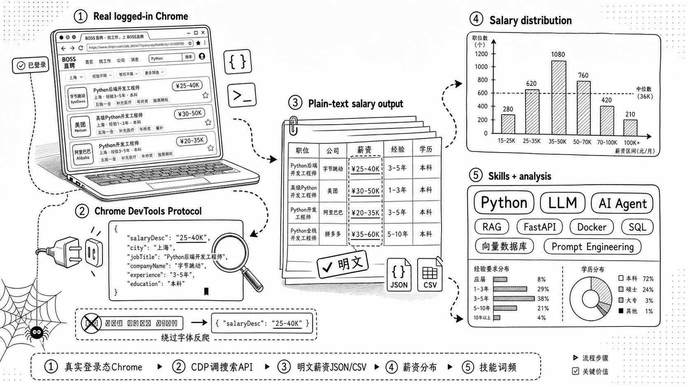

# BOSS直聘爬虫 · 职位抓取工具 v2.0（Chrome CDP / 明文薪资）

> 🌐 English documentation: [README.en.md](./README.en.md)


一个轻量的 **BOSS直聘爬虫（spider / crawler / scraper）**：通过 Chrome DevTools Protocol 连接本地已登录的 Chrome，复用真实登录态调用 zhipin.com 搜索 API，绕过前端字体反爬，输出含**明文薪资**的职位数据（JSON / CSV），并生成薪资分布、技能词频和求职材料优化提示词。同时作为 Career Scout Agent Skill 提供。

> 📌 **一句话介绍**：不用 Selenium/Playwright，直接通过 Chrome DevTools Protocol 连接本地已登录的 Chrome，复用真实登录态调搜索 API，输出含明文薪资的 JSON/CSV，并生成薪资分布、技能词频和求职材料优化提示词。



---

## ⚠️ 免责声明

本项目仅供学习和技术研究参考，旨在探讨 Chrome DevTools Protocol、前端反爬机制与数据采集技术。请勿用于任何违反 [BOSS直聘用户协议](https://www.zhipin.com/about/protocol.html) 或相关法律法规的用途，不得用于商业转售、恶意爬取或对目标网站造成负担的行为。使用本项目所产生的一切后果由使用者自行承担，作者不对任何滥用行为负责。

---

## 🚀 30 秒快速开始

```bash
# 1. 克隆 + 装依赖
git clone https://github.com/czyooutzilas-sketch/career-scout-preview.git
cd career-scout
pip install -r requirements.txt          # 或 uv sync

# 2. 启动隔离 Chrome 并登录（只需一次，登录态持久保存）
python3 scripts/boss_cdp_raw.py --setup-chrome

# 3. 抓取 + 分析
python3 scripts/boss_cdp_raw.py --keyword "AI Agent" --city 上海 --pages 3 --analysis

# 支持全国城市（含三四五线），例如：
python3 scripts/boss_cdp_raw.py --keyword "前端" --city 赣州 --pages 3
# 查看支持的城市：--list-cities [关键词]
python3 scripts/boss_cdp_raw.py --list-cities 江

# 4. 抓取后生成聚合摘要 + 提示词（默认读取最新结果）
python3 scripts/job_summary.py
```

抓完直接拿到：薪资分布、经验要求、高频技能词、求职材料优化提示词。CLI 提示词只基于岗位数据，不读取本地简历文件。可选的 AI 求职工作台会解析简历、生成关键词、流式展示岗位卡片并学习反馈偏好，但不会自动投递、联系招聘者或预测录用概率。

## AI 求职工作台

工作台的抓取任务使用统一的受控执行器：任务具有总超时和可追踪失败码，取消会终止子进程树，日志与产物大小受到限制，产物只能写入任务结果目录。岗位发现只会将具有有效 BOSS HTTPS 详情链接的岗位送入详情抓取、AI 评估和正式结果。

安装依赖后启动：

```bash
python3 webui/app.py
```

浏览器访问 `http://127.0.0.1:5000`。工作台是一个深色求职工作台：左侧可折叠设置区用于画像、简历和 AI 设置，主区为单列固定高度的大岗位卡片流。

### 核心能力

1. **简历解析**：上传 TXT / PDF / DOCX 简历后，AI 解析岗位方向、城市、技能与最多 3 组搜索关键词。用户可手动补充或覆盖，**手动条件永远优先**。
2. **后台搜索**：点击搜索后后台自动运行，最多 3 组关键词、跨查询去重、整个运行最多抓取 60 条完整 JD。每条完整 JD 岗位即时以卡片形式流式加入前端。
3. **岗位卡片**：卡片显示岗位名称、公司、薪资、地点和截断 JD；点击阅读区只打开经校验的 BOSS 链接（仅允许 HTTPS 且预期 BOSS 域名）。
4. **兴趣反馈与学习**：卡片内“感兴趣 / 不感兴趣”按钮**不会触发跳转**；不感兴趣会平滑退场并支持撤销。每 5 条有效反馈后 AI 更新当前画像偏好，只影响后续结果，不重排已展示卡片。
5. **历史与清理**：普通结果保留 30 天；感兴趣和已投递岗位保留到用户手动删除。

### AI URL 与 Key 配置

用户只需配置两项：AI 服务 URL 和 API Key。

- 在左侧设置区填写 AI 服务 URL（OpenAI 兼容的 `/v1/chat/completions` 端点）和 API Key。
- 点击“测试连接”确认配置可用。
- **Key 必须进入系统凭据库**（Windows Credential Manager / macOS Keychain / Linux Secret Service，通过 `keyring` 库），**绝不会明文写入 SQLite、日志、接口响应或导出文件**。
- 接口返回的 AI 设置只包含 URL、状态和最后错误码，不含 Key 或凭据引用。

### 隐私告知

- 简历原文、AI Key 只在本地处理，不上传到任何第三方（除你配置的 AI 服务外）。
- 所有简历读取、AI 设置读取和写操作均需本地会话令牌（`X-Boss-Token`）保护。
- 简历删除会原子地删除原文件、提取文本、内容哈希、文件名和未确认建议。
- 日志、历史、导出和错误信息中不会出现 Key 或简历正文。
- 只有 HTTPS 且属于预期 BOSS 域名（`zhipin.com`）的岗位链接才会被前端打开。

### 画像隔离

- 每份新简历默认创建新的求职画像，**不继承旧画像的 AI 负向偏好**。
- 兴趣反馈绑定当前画像，不感兴趣只影响当前画像的后续结果。
- 复制画像时只复制人工确认字段，AI 偏好不随复制迁移。

### 卡片交互

- 卡片固定高度，JD 自动截断（3 行省略），保持阅读流稳定。
- 点击卡片阅读区在**新标签页**打开经校验的 BOSS 岗位链接。
- “感兴趣 / 不感兴趣”按钮**不会跳转**，只记录反馈。
- 不感兴趣后卡片平滑退场，底部出现撤销条，5 秒内可撤销。

### 反馈学习

- 每累计 5 条有效反馈（感兴趣 / 不感兴趣，撤销的不计），AI 更新当前画像偏好。
- 偏好更新只影响**未来**的搜索结果和卡片排序，不会重排已展示的卡片。
- AI 输出由程序校验，**AI 不能决定任务状态或绕过人工筛选**。

### 不自动投递边界

本项目**不会**实现以下功能：

- 自动投递简历
- 自动联系招聘者或发送消息
- 录用概率预测

AI 只负责 JSON 结构化的简历解析、JD 排序和偏好更新，所有任务状态和投递动作由用户决定。

### 数据保留

| 类型 | 保留期 |
|------|--------|
| 普通结果 | 30 天后自动清理 |
| 感兴趣岗位 | 保留到用户手动删除 |
| 已投递岗位 | 保留到用户手动删除 |

清理操作不会触及简历目录或不受控路径，也不会删除收藏或已投递岗位。

### 状态目录

- 状态数据库：`~/.career-scout/webui/webui.db`
- 岗位结果：`~/.career-scout/job-result/`
- 简历文件：`~/.career-scout/webui/resumes/`

如需让 WebUI 使用指定 Python，可在启动前设置 `BOSS_PYTHON` 环境变量。

### 简历驱动的两层筛选（002）

在 001 工作台基础上叠加的筛选功能，通过两层核验提升结果匹配度。整体流程：

1. **上传简历**：用户上传 TXT / PDF / DOCX 简历（AI 不可用时可跳过）。
2. **AI 读取并给出建议值**：AI 读取简历内容，同时程序获取 BOSS 筛选选项枚举（薪资段、经验、学历、公司规模、融资阶段、行业、城市），AI 判断哪些选项可从简历填入，返回建议值。
3. **用户确认**：前端展示建议值，用户可改可不动；**用户确认值优先，AI 不得覆盖**。某字段 AI 没给且用户没填则留空。
4. **第一层搜索**：用确认后的条件调 BOSS 搜索 API 抓回一批职位，全部进入第二层。城市留空时按全国搜索。
5. **第二层核验**：对每条职位做两层核验——硬规则字段核验 + AI 语义相似度判断。本次 AI 语义相似度只留接口契约与**占位实现（恒返回过）**，约束框架待专门设计；接入时替换占位即可，不改动分流与区域逻辑。
6. **分流到符合/不符合临时区**：两条核验都过进符合区，任一不过进不符合区。符合区按抓回顺序排列，不使用相似度排序。不符合区混在一起展示，不标注被哪个字段排除。
7. **标记感兴趣/不感兴趣**：在符合区或不符合区任意岗位标记后进持久区。

字段无强制必填（含城市）：用户没选的字段不参与第一层搜索，也不参与第二层硬规则核验。

#### 两层核验

- **第一层**：用确认条件调 BOSS 搜索 API 抓回职位。
- **第二层**：对每条抓回职位做硬规则核验（确定性程序逻辑，不调 AI）+ AI 语义相似度判断（本次占位恒过，框架待设计）。两条都过进符合区，任一不过进不符合区。不符合区不区分排除原因，不标注。

#### 区域生命周期

| 区域 | 类型 | 生命周期 |
|------|------|----------|
| 符合区 | 本次执行临时区域 | 开始下一次执行时清空 |
| 不符合区 | 本次执行临时区域 | 开始下一次执行时清空 |
| 感兴趣区 | 持久区域 | 不受区域清空影响，长期保留 |
| 垃圾桶区 | 持久区域 | 不受区域清空影响，长期保留 |

#### 感兴趣区与垃圾桶区

- **感兴趣区**：用户点击"感兴趣"后该岗位进入持久感兴趣区，可长期回看。感兴趣区卡片可点击在浏览器打开对应的 BOSS 原始岗位页面，仅允许 HTTPS 且属于预期 BOSS 域名（`zhipin.com`）。
- **垃圾桶区**：用户点击"不感兴趣"后该岗位进入持久垃圾桶区，可查看曾标记不感兴趣的岗位列表。
- **展示排除**：后续搜索结果在展示时，曾标记不感兴趣的具体岗位被排除，不再展示。排除**仅在展示阶段**，不修改抓取结果；排除**仅按具体岗位识别**，不扩展到同公司或相似特征的其他岗位。

#### AI 不可用降级

AI 服务不可用时，系统提示用户并退化为：

- **跳过简历**：上传简历步骤可跳过。
- **人工填筛**：筛选栏退化为人工填写，字段无必填，留空即不限。
- **仅硬规则核验**：第二层只执行硬规则核验，不执行 AI 语义相似度判断。
- 第一层仍正常用确认条件调 BOSS 搜索 API 抓取。

#### 不自动投递边界

本项目**不会**实现以下功能：

- 不自动投递简历
- 不自动联系招聘者或发送消息
- 不预测录用概率

AI 只负责读简历给筛选项建议（未来负责语义相似度结构化输出），所有任务状态、分流裁定与投递动作由程序逻辑与用户决定，AI 不得决定任务状态或绕过程序判定。

#### 状态目录与测试

- 状态目录：复用 001 的 `~/.career-scout/webui/`（筛选运行 `screening_runs`/`screening_results` 写入同一 `webui.db`，第一层抓取产物写入 `~/.career-scout/job-result/`）。
- 依赖：复用 001 既有依赖，无新增第三方库。
- 自动化测试：`python -m unittest discover -s tests -v`

Windows PowerShell 若希望终端完整显示 emoji，可选设置：

```powershell
$env:PYTHONUTF8 = "1"
$env:PYTHONIOENCODING = "utf-8"
python webui/app.py
```

## ✨ 特性

- 明文薪资（API 模式，绕过字体反爬）
- JSON / CSV 双格式输出
- 详情页 JD 抓取 + 技能分析
- 抓取后聚合摘要 + 可复制提示词
- 增量写入（异常退出不丢数据）
- 一键环境检查 + 持久隔离 Chrome CDP profile
- 多维筛选（规模、融资、薪资、经验、学历、行业）
- macOS + Linux 支持；Windows 路径、进程解析和 WebUI 已有自动化测试，真实抓取仍需在本机 Chrome 登录态下验证

<details>
<summary>🔍 为什么不选 Selenium / Playwright 类爬虫？</summary>

- Selenium/Playwright 会启动完整的受控浏览器，体积大、指纹明显，容易触发 BOSS 的风控和验证码。
- 本工具直接连接你已经登录的真实 Chrome（CDP），复用真实指纹和登录态，调用的也是页面内合法的搜索 API，返回的 `salaryDesc` 本就是明文——不需要解析被字体反爬加密的 DOM 薪资。
- 因此比传统 DOM 抓取类爬虫更稳定，也更难被识别为自动化流量。

</details>

## 安装

### 方式 1：克隆到本地再安装（推荐）

由于 `hermes skills install` 的网络请求在某些环境下可能无法直接访问 GitHub，推荐先克隆仓库再本地安装：

```bash
# 1. 克隆仓库
git clone https://github.com/czyooutzilas-sketch/career-scout-preview.git
cd career-scout

# 2. 复制到 Career Scout skills 目录
mkdir -p ~/.hermes/skills/data-science/career-scout/scripts
cp SKILL.md ~/.hermes/skills/data-science/career-scout/
cp scripts/boss_cdp_raw.py ~/.hermes/skills/data-science/career-scout/scripts/
cp scripts/job_summary.py ~/.hermes/skills/data-science/career-scout/scripts/
```

### 方式 2：curl 一键安装

不需要克隆整个仓库，直接下载必要文件：

```bash
mkdir -p ~/.hermes/skills/data-science/career-scout/scripts && \
curl -sL https://raw.githubusercontent.com/czyooutzilas-sketch/career-scout-preview/master/SKILL.md \
  -o ~/.hermes/skills/data-science/career-scout/SKILL.md && \
curl -sL https://raw.githubusercontent.com/czyooutzilas-sketch/career-scout-preview/master/scripts/boss_cdp_raw.py \
  -o ~/.hermes/skills/data-science/career-scout/scripts/boss_cdp_raw.py && \
curl -sL https://raw.githubusercontent.com/czyooutzilas-sketch/career-scout-preview/master/scripts/job_summary.py \
  -o ~/.hermes/skills/data-science/career-scout/scripts/job_summary.py
```

### 方式 3：hermes skills install（需网络直连 GitHub）

```bash
hermes skills install https://raw.githubusercontent.com/czyooutzilas-sketch/career-scout-preview/master/SKILL.md --category data-science
```

> 注意：此方式依赖 hermes 进程能直接访问 GitHub，如果遇到超时或连接失败，请使用方式 1 或 2。

### 验证安装

```bash
# 检查文件是否存在
ls ~/.hermes/skills/data-science/career-scout/SKILL.md
ls ~/.hermes/skills/data-science/career-scout/scripts/boss_cdp_raw.py
ls ~/.hermes/skills/data-science/career-scout/scripts/job_summary.py
```

安装后直接在 Career Scout 对话中说"帮我搜一下 BOSS直聘 上上海的 AI Agent 岗位"。

## 作为命令行工具使用

不想装成 Skill 也可以直接当 CLI 用：

```bash
# 1. 克隆 + 安装依赖
git clone https://github.com/czyooutzilas-sketch/career-scout-preview.git
cd career-scout
pip install -r requirements.txt

# 2. 启动 Chrome CDP
python3 scripts/boss_cdp_raw.py --setup-chrome
# 首次使用也不会复制主 Chrome 登录态；请在弹出的 BOSS 专用浏览器中登录 zhipin.com
# setup 会等待登录完成，并确认接口能返回明文薪资

# 3. 检查环境
python3 scripts/boss_cdp_raw.py --check

# 可选：真实浏览器/API smoke test（不写结果文件）
python3 scripts/boss_cdp_raw.py --smoke-test

# 4. 抓取
python3 scripts/boss_cdp_raw.py --keyword "AI Agent" --city 上海 --pages 3 --format csv --analysis

# 5. 抓取后摘要和提示词
python3 scripts/job_summary.py --top 15
```

## 参数

| 参数 | 说明 |
|------|------|
| `--keyword` | 搜索关键词（默认 "AI Agent"） |
| `--city` | 城市（中文或代码，默认上海）。**支持全国城市**（一二三四五线全覆盖，共 300+ 个），运行时自动从 BOSS 同步最新城市码；码表见 [`data/city_codes.json`](data/city_codes.json)，或用 `--list-cities` 查看 |
| `--list-cities [关键词]` | 打印支持的城市列表，可选关键词过滤，如 `--list-cities 江` |
| `--pages` | 页数（上限 10） |
| `--format` | json / csv；csv 会同时导出列表和详情 CSV |
| `--detail` | 抓取详情页 JD（默认开启） |
| `--no-detail` | 不抓取详情页 |
| `--analysis` | 分析报告 |
| `--merge FILE` | 合并已有数据（按 job_id 去重） |
| `--allow-dom-fallback` | API 无数据时允许降级 DOM 提取；默认关闭，薪资可能不可信 |
| `--check` | 环境检查（CDP + 依赖 + 登录态） |
| `--smoke-test` | 用真实 Chrome/CDP 跑一次 BOSS 搜索 API smoke test，不写结果文件 |
| `--setup-chrome` | 一键启动 Chrome CDP（持久隔离 profile） |
| `--copy-login-state` | 手动导入主 Chrome 的 Local State + Cookie 相关文件到隔离 profile（默认、首次启动、重复启动都不复制） |
| `--reset-chrome-profile` | 重建 BOSS 专用 Chrome profile，会清除此专用浏览器内的登录态 |
| `--no-wait-login` | `--setup-chrome` 启动后不等待登录完成 |
| `--login-timeout` | `--setup-chrome` 等待登录完成的秒数（默认 300） |
| `--output` | 列表输出路径（默认 `~/.career-scout/job-result/`） |
| `--detail-output` | 详情输出路径（默认 `~/.career-scout/job-result/`） |
| `--cdp-port` | CDP 端口（默认 9222） |
| `--scale/--salary/--experience/--degree` | 筛选条件 |

## 抓取后摘要与提示词

`scripts/job_summary.py` 只读取已抓取的 `boss_jobs_*.json` 和 `boss_details_*.json`，做简单聚合分析并生成一段可复制提示词。它不读取本地简历文件，不引入 PDF 依赖，也不给个人与岗位做分数判断。

```bash
# 读取默认结果目录下最新的 boss_jobs_*.json，并自动匹配同时间戳或最新详情文件
python3 scripts/job_summary.py

# 指定列表和详情文件
python3 scripts/job_summary.py \
  --input ~/.career-scout/job-result/boss_jobs_20260625_1200.json \
  --details ~/.career-scout/job-result/boss_details_20260625_1200.json \
  --top 15

# 只输出提示词
python3 scripts/job_summary.py --prompt-only
```

打包安装后也可以使用入口命令：

```bash
uv run career-summary --top 15
```

摘要会覆盖这些维度：薪资区间、经验要求、学历要求、地区分布、高频公司、技能标签、JD 高频词。提示词会要求模型基于这些统计去做简历关键词补齐、项目经历改写方向和面试准备清单，但明确要求不要虚构经历。

## 文件结构

```
career-scout/
├── SKILL.md              # Career Scout Skill 定义
├── README.md
├── CHANGELOG.md
├── LICENSE
├── pyproject.toml
├── scripts/
│   ├── boss_cdp_raw.py   # 抓取主脚本
│   └── job_summary.py    # 抓取后摘要 + 提示词
├── webui/
│   ├── app.py            # Flask API + 后台任务编排
│   ├── core.py           # 参数校验 + 可解释匹配
│   ├── store.py          # SQLite 任务/日志/画像/搜索运行/反馈
│   ├── workbench.py      # 关键词选择、去重、预算、卡片投影等纯校验
│   ├── resume.py         # 简历存储、提取、路径校验、原子删除
│   ├── ai.py             # AI 连接测试、凭据库引用、JSON 合同校验
│   └── index.html        # 深色求职工作台前端
└── requirements.txt
```

## 工作原理

这是一个基于 Chrome CDP 的 BOSS直聘爬虫，核心流程：

1. 通过 Chrome DevTools Protocol (CDP) 连接到已打开的 Chrome
2. 在 BOSS直聘页面内注入 JS，用同步 XHR 调用搜索 API
3. API 返回明文 `salaryDesc`，绕过前端字体反爬
4. 列表 API 保留 `securityId` / `lid` 等上下文，进入详情页时带上这些参数
5. 每页抓完立即写入文件，按 `job_id` 去重

默认不会使用 DOM 提取列表，因为 DOM 薪资可能受字体反爬影响。只有明确传 `--allow-dom-fallback` 时，API 无数据才会降级 DOM。

详情页只从包含“职位描述”的详情区提取 JD，整页 `body` 仅用于识别登录墙和导航页，不会直接写入结果。若页面出现“登录查看完整内容”，抓取会明确报错并停止，避免把截断正文、招聘者信息、公司介绍和推荐职位当成完整 JD 保存。

`--input ... --analysis --no-detail` 会优先加载 `--detail-output`，其次加载与输入列表同目录、同时间戳的 `boss_details_*.json`，最后查找 `~/.career-scout/job-result` 下最新详情文件。

## Chrome profile 安全策略

`--setup-chrome` 默认使用持久隔离 profile，不软链接、不复制你的主 Chrome 数据。首次启动和后续重复启动都只是创建或复用这个专用 profile：

- `~/.career-scout/chrome-profile`

未显式指定 `--output` 或 `--detail-output` 时，抓取结果默认保存到：

- `~/.career-scout/job-result`

首次使用需要在这个专用 Chrome 中手动登录 BOSS直聘。`--setup-chrome` 会等待登录完成，并用搜索接口确认能拿到明文 `salaryDesc` 后再返回。登录态保存在专用 profile 内，重启机器后仍然保留；重复运行 `--setup-chrome` 不会清空它，也不会影响主 Chrome、Gmail、GitHub 等账号。

如确实需要从主 Chrome 手动导入 BOSS 登录态，可以显式运行：

```bash
python3 scripts/boss_cdp_raw.py --setup-chrome --copy-login-state
```

`--copy-login-state` 每次运行都会覆盖隔离 profile 内对应的 Cookie 相关文件；日常启动不要加这个参数。它只复制 `Local State` 和 `Default/Cookies*`、`Default/Network/Cookies*` 这类 Cookie 数据库相关文件，不复制密码库、历史记录、扩展或完整 profile。需要清空专用浏览器登录态时使用：

```bash
python3 scripts/boss_cdp_raw.py --setup-chrome --reset-chrome-profile
```

## 📌 TODO

- [ ] 详情页抓取补强 Referer 与请求指纹，进一步降低风控触发概率

## License

MIT

## 友情链接

- [LINUX DO](https://linux.do/) — 真诚、友善、充满活力的技术社区，本项目认可并推荐。

## Star History

[](https://star-history.com/#czyooutzilas-sketch/career-scout-preview&Date)
