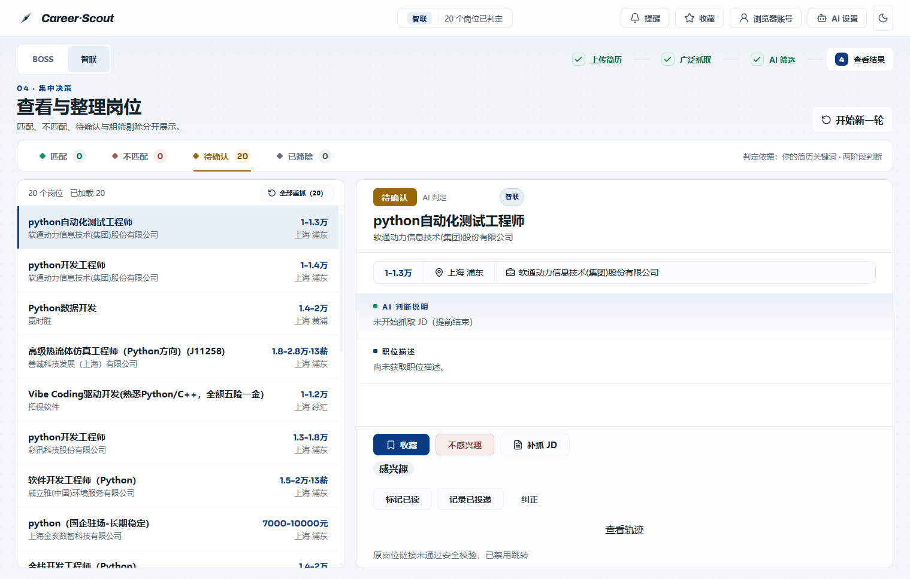
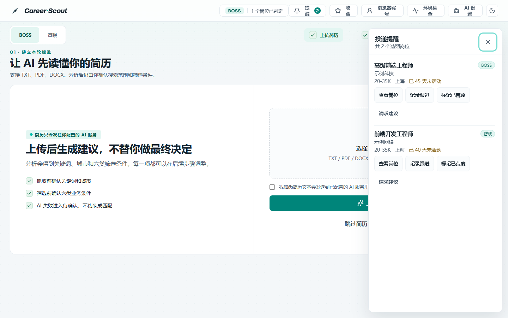

# Career Scout v2.5 · BOSS直聘 & 智联招聘职位助手

Career Scout 是一个基于 Chrome DevTools Protocol（CDP）的多平台职位搜索与求职工具，目前支持 **BOSS 直聘** 和 **智联招聘**。它连接你本机已经登录的 Chrome，复用真实登录态抓取职位列表与 JD 详情，并通过本地 Web 工作台完成简历驱动的两层筛选、AI 语义评估、岗位生命周期管理和投递过期提醒。

所有数据默认保存在本机 `~/.career-scout`，AI Key 存入系统凭据库，不会写入项目文件或日志。

## 界面预览

智联平台 AI 筛选结果页：



投递过期提醒抽屉（BOSS 与智联岗位统一提醒，不按平台过滤）：



## 免责声明

本项目仅供学习和技术研究参考。使用前请阅读 [BOSS直聘用户协议](https://www.zhipin.com/about/protocol.html)、智联招聘相关服务条款及相关法律法规，不要用于商业转售、恶意爬取或对目标网站造成负担。使用本项目产生的一切后果由使用者自行承担。

## 快速开始

### 环境要求

- Python 3.10+
- Chrome 浏览器
- 可选：Node.js 20+（仅在修改 WebUI 前端源码时需要）

### 安装

```bash
git clone https://github.com/Czilasy/career-scout-preview.git
cd career-scout-preview
pip install -r requirements.txt
# 或使用 uv
uv sync
```

### 启动专用 Chrome 并登录

```bash
python scripts/boss_cdp_raw.py --setup-chrome
```

脚本会启动一个独立的 BOSS 专用 Chrome。请在弹出的窗口中登录 zhipin.com；登录态保存在独立 Chrome profile 中，只需登录一次。智联招聘同样在 Web 工作台的"浏览器账号"中完成一次登录即可，登录态按平台隔离保存。

### 抓取职位（BOSS CLI）

```bash
python scripts/boss_cdp_raw.py --keyword "AI Agent" --city 上海 --pages 3
```

结果默认写入 `~/.career-scout/job-result/boss_jobs_*.json`，使用 `--format csv` 可输出 CSV。

常用参数：

| 参数 | 说明 |
| --- | --- |
| `--keyword` | 搜索关键词，默认 `AI Agent` |
| `--city` | 城市名或城市码，默认上海 |
| `--pages` | 抓取页数 |
| `--start-page` | 从第几页开始，支持断点续抓 |
| `--detail` / `--no-detail` | 是否抓取 JD 详情，默认开启 |
| `--max-details` | 最多抓取多少个详情 |
| `--format` | 输出格式：`json` 或 `csv` |
| `--analysis` | 抓取后输出分析报告 |
| `--input` | 从已有 JSON 文件读取，跳过抓取 |
| `--check` | 环境诊断 |
| `--smoke-test` | 真实浏览器/API 冒烟测试，不写结果文件 |
| `--setup-chrome` / `--stop-chrome` | 启动 / 关闭专用 Chrome |
| `--list-cities` | 查看支持的城市列表 |

抓取被风控或验证码拦截时，脚本会停止并保留已抓数据，提示停在第几页和原因；问题解除后可使用 `--start-page` 从断点继续。

智联招聘的完整流程（搜索、抓取、JD 提取、AI 筛选）通过下方 Web 工作台的平台切换完成。

### 生成求职摘要与提示词

```bash
python scripts/job_summary.py
```

默认读取 `~/.career-scout/job-result` 下最新的 `boss_jobs_*.json`，输出岗位市场摘要和可复制的求职材料优化提示词；`--prompt-only` 只输出提示词。

### 启动 Web 工作台

```bash
python webui/app.py
```

浏览器访问 `http://127.0.0.1:5000`。Windows 用户也可以直接双击 `tools/start.bat`，脚本会自动检查前端构建状态并处理旧服务进程。

## 核心功能

### 多平台：BOSS 直聘 + 智联招聘

- 顶栏一键切换平台，搜索条件、筛选字段、城市选项按各平台规则独立加载。
- 岗位在入库时冻结来源平台身份，结果页按平台隔离展示：BOSS 的结果只含 BOSS 岗位，智联的结果只含智联岗位。
- 两个平台共用同一套岗位生命周期、提醒与 AI 建议规则，无需理解平台专属逻辑。

### 岗位发现流水线

- 按"上传简历分析 → 确认搜索条件 → 粗筛/抓 JD/精筛 → 查看结果"分步推进，AI 筛选与抓取分开执行，不会合并成一次不可控的自动执行。
- 简历驱动的两层筛选：第一层来自平台搜索结果，第二层是硬规则与 AI 语义评估；AI 不可用时可降级为人工填筛、跳过简历或仅硬规则。
- 结果区域：符合/不符合为临时区，感兴趣/垃圾桶为持久区；结果按匹配、不匹配、待确认、已筛除分类展示。

### 岗位反馈闭环与投递过期提醒

- **生命周期记录**：在岗位详情中标记已读、已投递、已荒废并可纠正误操作；已投递记录真实投递时间，跟进记录独立的最后跟进时间。
- **过期提醒**：已投递满 30 天（精确 30 × 24 小时）且无跟进的岗位进入顶部导航的提醒徽标与抽屉，按最长未活动时间排序；记录跟进或标记已荒废后提醒即时清除。
- **按需 AI 建议**：针对单个逾期岗位请求 AI 建议，输出仅限"跟进"或"复核"两类行动方向；AI 不可用时返回规则式兜底建议，AI 不会替用户改变岗位状态。
- **客观事件轨迹**：所有状态与时间操作追加不可覆盖的生命周期事件，与"感兴趣/不感兴趣"偏好反馈完全分离。

### 运行可靠性

- **断点续跑**：遇到验证码、登录过期、来源封禁或 AI 限流时会暂停并说明原因；服务重启后可从持久化断点继续，已抓列表、JD 和 AI 判定不会重复。
- **浏览器账号**：内置 A/B 账号，可添加自定义账号；每个账号使用独立 Chrome profile，登录态持久化且按平台隔离。
- **高级设置与调优实验**：可调整列表抓取、JD 抓取和 AI 筛选参数；提供实验与验证框架。
- **历史恢复**：可预演、准备并执行历史任务恢复；旧数据缺少具体失败原因时会明确标注，不猜造分类。

## 隐私与安全边界

- 职位数据、简历和 AI Key 只在本地处理；AI Key 通过系统凭据库保存（Windows Credential Manager / macOS Keychain / Linux Secret Service），不写入 SQLite、日志或导出文件。
- 简历读取、AI 设置读写等接口使用本地会话令牌保护。
- 前端只打开岗位所属平台域名的 HTTPS 规范链接（BOSS 为 `zhipin.com`，智联为 `zhaopin.com`），链接必须通过平台规则校验，不接受任意外部地址。
- 项目不会自动投递、自动联系招聘者或预测录用概率；已荒废等状态只能由用户显式设置，程序和 AI 均不会自动改写。
- 失败状态如实展示：被风控、验证码、登录过期、限流等情况会区分原因，不会伪装成成功。

## 目录结构

```text
scripts/boss_cdp_raw.py      # BOSS CLI 抓取主入口
scripts/job_summary.py       # 抓取结果 → 求职摘要与提示词
data/city_codes.json         # BOSS 城市码表
data/zhilian_city_codes.json # 智联城市码表
webui/                       # Flask 后端 + Vue 3 前端源码
webui/platforms.py           # 平台注册表、筛选 schema 与城市目录
webui/job_feedback*.py       # 生命周期、提醒与反馈 API
webui/job_advice.py          # 按需 AI 行动建议
webui/dist/                  # 已构建的前端产物，普通用户无需 Node.js
tests/                       # unittest，全 mock，无需真实 Chrome/网络
docs/screenshots/            # README 所用界面截图
tools/start.bat              # Windows 一键启动 Web 工作台
pyproject.toml               # 打包配置，入口 career-scout / career-summary
requirements.txt             # Python 依赖
```

## 开发与测试

```bash
python -m unittest discover -s tests
cd webui
npm install
npm test
npm run build
```

修改前端源码后必须重新构建并提交 `webui/dist`，否则 Web 工作台可能使用旧构建产物。

想参与贡献请先阅读 [CONTRIBUTING.md](./CONTRIBUTING.md)；发现安全问题请阅读 [SECURITY.md](./SECURITY.md)。

## License

Apache License 2.0，详见 [LICENSE](./LICENSE)。
