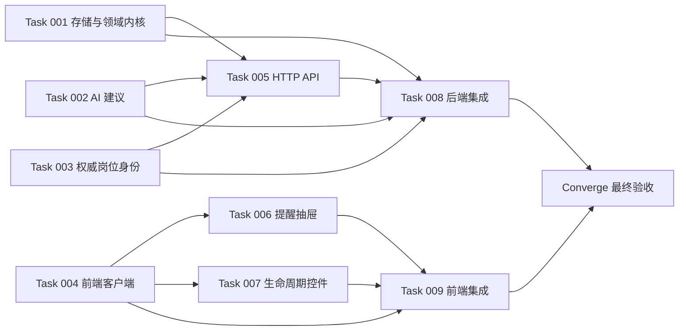

# Tasks：岗位反馈闭环与投递过期提醒

**输入**：`specs/002-job-feedback-reminders/` 下已冻结的 `spec.md`、`plan.md`、`research.md`、`data-model.md`、`contracts/` 和 `quickstart.md`

**执行方式**：用户已明确指定多 AI、多会话并行。实现共拆为 9 个执行包；每个会话只领取一个 `tasksNNN.md`，不得顺带执行后续包。

**状态**：已 Converge。Wave 1 → Wave 2 → Wave 3 全部完成，功能代码在提交 `696070d` 落地；最终回归与两视口真实 UI 验收于 2026-08-06 通过，证据见文末“收敛证据”小节。

## 清单格式

- `[P]` 只标记每个可并行执行包的启动项。领取该包的会话按包内顺序继续执行，其它会话可同时推进不同写入范围。
- `[US1]` 生命周期快照与手动操作。
- `[US2]` 30 天投递提醒。
- `[US3]` 按需 AI 行动建议。
- `[US4]` BOSS/智联权威身份与平台无关行为。
- `[US5]` 客观生命周期事件与偏好反馈隔离。
- 所有编号在本文件全局唯一；执行包中的编号必须逐项回填完成证据，不得自行新增或改写业务合同。

## 启动总门禁

1. 新会话先读取仓库根 `AGENTS.md`、所领执行包及其“必读文件”。
2. 检查 `git status --short`；工作区已有用户/其它会话改动，禁止还原、覆盖、批量格式化或暂存不属于本包的文件。
3. `spec.md`、`data-model.md`、`contracts/http-api.md`、`contracts/ui-interaction.md` 是冻结合同。发现矛盾时停止并回报主会话，不得在实现会话自行改合同。
4. 并行会话使用互斥写入范围。共享入口只由 Task 008/009 所有者修改。
5. 每个包先写或补齐失败测试，再实现，再运行聚焦回归；测试失败、越界改动或仓库共享暂存区不干净时禁止提交。
6. 提交前运行本包命令、`uv run python -m unittest tests.test_repo_hygiene`、`git diff --check`、`git status --short` 和 `git diff --cached`；仅暂存本包文件，commit email 固定为 `czyooutzilas@gmail.com`。
7. 并行 Wave 中，执行会话不得使用 broad `git add .`、不得提交其它会话文件；为避免共享 Git index 竞态，主会话在该 Wave 全部返回后统一运行仓库卫生、差异审计并按任务范围创建小步提交。执行会话先提交聚焦测试、差异和变更路径证据。

## Wave 1：基础合同实现（四路并行）

### Task 001：migration、生命周期事务、事件回执与提醒投影

**执行包**：[`tasks001.md`](tasks001.md)

- [x] T001 [P] [US1] 读取并记录 `webui/store.py`、`webui/job_feedback.py`、`tests/test_webui_store.py`、`tests/test_job_feedback.py` 的当前基线、既有改动和可复用存储接口
- [x] T002 [US1] 在 `tests/test_webui_store.py` 添加 migration 27→28 备份、schema、幂等初始化、失败回滚和数据守恒的先失败测试
- [x] T003 [US1] 在 `webui/store.py` 实现 migration 28、`last_follow_up_at`、事件/命令回执表、索引、备份目标 28 和迁移后完整性检查
- [x] T004 [US1] 在 `tests/test_job_feedback.py` 添加 action 矩阵、时间校验、幂等重放、异载荷冲突、并发和事务回滚的先失败测试
- [x] T005 [US1] 在 `webui/job_feedback.py` 实现状态/action 常量、RFC 3339 UTC 规范化、命令指纹、错误类型和动作语义
- [x] T006 [US4] 在 `webui/store.py` 抽取接收现有 SQLite connection 的双索引岗位 upsert/解析 helper，并让现有公开 upsert 复用同一算法
- [x] T007 [US1] 在 `webui/store.py` 与 `webui/job_feedback.py` 实现岗位解析、画像关联、快照、回执和真实变化事件的单事务生命周期命令
- [x] T008 [US5] 在 `webui/store.py` 与 `tests/test_job_feedback.py` 实现并验证当前快照/revision 读取、按 sequence 事件读取以及 no-op 不生成客观事件
- [x] T009 [US2] 在 `tests/test_job_feedback.py` 添加阈值前/等于/阈值后、跟进优先、损坏时间、画像隔离、101 条和稳定排序的先失败提醒测试
- [x] T010 [US2] 在 `webui/job_feedback.py` 与 `webui/store.py` 实现无平台过滤的提醒投影、全量 count 和最多 100 条 list
- [x] T011 [US5] 在 `tests/test_webui_store.py` 与 `tests/test_job_feedback.py` 验证生命周期不修改 `feedback_events`，清理只删除 `status='new'` 且无生命周期事实的记录
- [x] T012 [US1] 运行 `tests.test_webui_store` 与 `tests.test_job_feedback`，修复 `webui/store.py`、`webui/job_feedback.py` 范围内回归并确认 RED→GREEN 证据
- [x] T013 [US1] 检查并仅提交 `webui/store.py`、`webui/job_feedback.py`、`tests/test_webui_store.py`、`tests/test_job_feedback.py`，提交信息使用 `feat: add job lifecycle storage`

### Task 002：AI 建议适配器与规则兜底

**执行包**：[`tasks002.md`](tasks002.md)

- [x] T014 [P] [US3] 读取 `webui/ai.py`、`tests/test_ai.py` 和冻结 advice 合同，记录可复用 AI 调用边界但不修改这些既有文件
- [x] T015 [US3] 在 `tests/test_job_advice.py` 添加正常 AI、缺 JD、未配置、超时、网络失败、无效 JSON 和非法 action 的先失败测试
- [x] T016 [US3] 在 `tests/test_job_advice.py` 添加输入最小化、平台字段缺席、输出清洗以及调用前后状态/事件零变化测试
- [x] T017 [US3] 在 `webui/job_advice.py` 实现仅含 JD、投递时间、最后跟进时间和经过天数的建议输入构造
- [x] T018 [US3] 在 `webui/job_advice.py` 实现 `follow_up|review` allowlist、用户文案清洗、AI source 投影和异常信息隔离
- [x] T019 [US3] 在 `webui/job_advice.py` 实现缺 JD 固定 `review`、其它 AI 故障有 JD 时 `follow_up` 的只读规则兜底
- [x] T020 [US3] 运行 `tests.test_job_advice` 与 `tests.test_ai`，仅提交 `webui/job_advice.py`、`tests/test_job_advice.py`，提交信息使用 `feat: add job advice fallback`

### Task 003：pipeline 权威岗位身份解析

**执行包**：[`tasks003.md`](tasks003.md)

- [x] T021 [P] [US4] 读取 `webui/platforms.py`、`webui/store.py`、`webui/app.py` 的岗位身份现状，记录 BOSS/智联 URL 校验和双索引协议但不修改共享文件
- [x] T022 [US4] 在 `tests/test_pipeline_job_identity.py` 添加内部 job ID、完整权威三元组和展示字段规范化的先失败测试
- [x] T023 [US4] 在 `tests/test_pipeline_job_identity.py` 添加三元组缺失、平台 URL 错配、内部 ID/三元组冲突和双索引冲突零副作用测试
- [x] T024 [US4] 在 `tests/test_pipeline_job_identity.py` 添加跨平台同裸 ID、相似标题/公司不合并及禁止从当前 UI 平台猜身份的测试
- [x] T025 [US4] 在 `webui/pipeline_job_identity.py` 定义冻结的权威身份 DTO、领域错误和 store connection-helper protocol
- [x] T026 [US4] 在 `webui/pipeline_job_identity.py` 实现内部 ID 校验、三元组完整性检查、平台 URL 校验和规范展示字段投影
- [x] T027 [US4] 在 `webui/pipeline_job_identity.py` 实现调用方 transaction 内的解析/upsert 编排，并使用 fake store 证明成功与冲突路径
- [x] T028 [US4] 运行 `tests.test_pipeline_job_identity`，仅提交 `webui/pipeline_job_identity.py`、`tests/test_pipeline_job_identity.py`，提交信息使用 `feat: add authoritative job identity resolver`

### Task 004：前端类型、API client 与并发保护

**执行包**：[`tasks004.md`](tasks004.md)

- [x] T029 [P] [US1] 在 `webui/src/__tests__/jobFeedback.spec.ts` 添加生命周期 state/action/event 类型映射和错误响应的先失败测试
- [x] T030 [US2] 在 `webui/src/__tests__/jobFeedback.spec.ts` 添加提醒 count/list、100 条上限和真实 total 投影的先失败测试
- [x] T031 [US3] 在 `webui/src/__tests__/jobFeedback.spec.ts` 添加 advice allowlist、source 和服务端错误投影的先失败测试
- [x] T032 [US1] 在 `webui/src/__tests__/jobFeedback.spec.ts` 添加一次用户确认生成 request ID、不确定重试复用、再次确认生成新 ID 的测试
- [x] T033 [US1] 在 `webui/src/__tests__/jobFeedback.spec.ts` 添加低 revision 响应不得覆盖较新 state 的测试
- [x] T034 [US4] 在 `webui/src/__tests__/jobFeedback.spec.ts` 添加内部 ID/权威三元组 payload 构造、身份不完整阻断和平台安全 URL 校验测试
- [x] T035 [US1] 在 `webui/src/jobFeedback.ts` 实现冻结类型、状态标签、API client、错误类、request ID 重试上下文和 revision 合并 helper
- [x] T036 [US1] 在 `webui` 运行 `npm test -- src/__tests__/jobFeedback.spec.ts` 与 `npm run build`，仅提交 `webui/src/jobFeedback.ts`、`webui/src/__tests__/jobFeedback.spec.ts`，提交信息使用 `feat: add job feedback client`

**Wave 1 检查点**：Task 001-004 各自聚焦测试通过、写入范围互斥、冻结合同未被修改后，才能解锁 Wave 2。Task 003 以冻结 connection-helper protocol 和 fakes 独立完成，真实 store 装配留给 Task 008。

## Wave 2：后端 API 与独立前端组件（三路并行）

### Task 005：生命周期、提醒、事件与建议 HTTP API

**硬前置**：Task 001、002、003 完成。

**执行包**：[`tasks005.md`](tasks005.md)

- [x] T037 [P] [US1] 读取 Task 001-003 最终模块与 `webui/app.py` 现有路由约定，在 `tests/test_job_feedback_api.py` 建立隔离 route registrar 测试夹具
- [x] T038 [US5] 在 `tests/test_job_feedback_api.py` 添加 state/events 只读、revision、分页上限和偏好事件不混入的先失败合同测试
- [x] T039 [US1] 在 `tests/test_job_feedback_api.py` 添加七种 action、权威身份首次入库、幂等重放、失败回滚和稳定错误体的先失败合同测试
- [x] T040 [US1] 在 `webui/job_feedback_api.py` 实现 state、actions、events route registrar，并把领域错误稳定映射为冻结 HTTP 状态与 error_code
- [x] T041 [US2] 在 `webui/job_feedback_api.py` 与 `tests/test_job_feedback_api.py` 实现 count/list 共用投影、当前画像隔离、最大 100 条和读取零副作用
- [x] T042 [US3] 在 `webui/job_feedback_api.py` 与 `tests/test_job_feedback_api.py` 实现单岗位逾期 advice 路由、规则兜底和请求前后状态零变化
- [x] T043 [US4] 在 `tests/test_job_feedback_api.py` 验证所有生命周期/提醒/建议路由无平台过滤，BOSS 与智联同规则且身份错误零副作用
- [x] T044 [US1] 运行 `tests.test_job_feedback_api`、`tests.test_job_feedback`、`tests.test_job_advice`、`tests.test_pipeline_job_identity` 并修复本包范围内回归
- [x] T045 [US1] 仅提交 `webui/job_feedback_api.py`、`tests/test_job_feedback_api.py`，提交信息使用 `feat: add job feedback api`；不得修改或注册 `webui/app.py`

### Task 006：提醒抽屉组件

**硬前置**：Task 004 完成。

**执行包**：[`tasks006.md`](tasks006.md)

- [x] T046 [P] [US2] 在 `webui/src/components/__tests__/ReminderDrawer.spec.ts` 添加 loading/error/empty/populated/旧数据保留状态的先失败组件测试
- [x] T047 [US2] 在 `webui/src/components/ReminderDrawer.vue` 实现稳定尺寸的 dialog/drawer 外壳、标题、关闭、Escape、焦点进入与关闭后恢复协议
- [x] T048 [US2] 在 `webui/src/components/ReminderDrawer.vue` 实现 total、最多 100 项、稳定排序展示、内部单滚动区和重试状态
- [x] T049 [US2] 在 `webui/src/components/ReminderDrawer.vue` 实现岗位信息、来源、未活动天数以及跟进/荒废/建议三类动作布局
- [x] T050 [US2] 在 `webui/src/components/ReminderDrawer.vue` 与组件测试中实现逐项 action busy、服务端刷新驱动退出、失败保留原项且不本地伪清除
- [x] T051 [US3] 在 `webui/src/components/ReminderDrawer.vue` 与组件测试中实现逐项 advice loading/result/error、`AI|规则` 来源和不自动执行建议
- [x] T052 [US4] 在 `webui/src/components/ReminderDrawer.vue` 与组件测试中实现仅 `can_open` 且前端复验安全的 canonical URL 可跳转
- [x] T053 [US2] 在 `webui/src/components/ReminderDrawer.vue` 的 scoped CSS 实现 1440×900 抽屉与 390×844 全屏布局、44px 点击区及无横向溢出
- [x] T054 [US2] 在 `webui` 运行 `npm test -- src/components/__tests__/ReminderDrawer.spec.ts src/__tests__/jobFeedback.spec.ts` 与 `npm run build`，仅提交本组件及其测试

### Task 007：岗位详情生命周期控件

**硬前置**：Task 004 完成。

**执行包**：[`tasks007.md`](tasks007.md)

- [x] T055 [P] [US1] 在 `webui/src/components/__tests__/JobLifecycleActions.spec.ts` 添加详情变化读取 state、只查看零 action 和加载/失败状态的先失败测试
- [x] T056 [US4] 在 `webui/src/components/JobLifecycleActions.vue` 实现内部 job ID 或完整权威三元组读取/写入，成功后采用服务端内部 ID
- [x] T057 [US1] 在 `webui/src/components/JobLifecycleActions.vue` 实现唯一当前状态和已读、已投递、跟进、荒废、恢复主命令
- [x] T058 [US1] 在 `webui/src/components/JobLifecycleActions.vue` 实现紧凑纠正表单、目标状态、带时区投递时间和 applied 缺时间补充入口
- [x] T059 [US1] 在组件与 `webui/src/components/__tests__/JobLifecycleActions.spec.ts` 实现同岗位写锁、request ID 重试复用、无乐观写和 revision 防倒退
- [x] T060 [US5] 在 `webui/src/components/JobLifecycleActions.vue` 与组件测试中实现按需事件轨迹展开、sequence 分页及偏好反馈不混入
- [x] T061 [US4] 在组件与 `webui/src/components/__tests__/JobLifecycleActions.spec.ts` 实现身份不完整阻断、URL 不安全禁用和不从 UI 平台猜身份
- [x] T062 [US1] 在 `webui/src/components/JobLifecycleActions.vue` 的 scoped CSS 实现桌面/窄屏可达操作、可见焦点、错误文案和无横向溢出
- [x] T063 [US1] 在 `webui` 运行 `npm test -- src/components/__tests__/JobLifecycleActions.spec.ts src/__tests__/jobFeedback.spec.ts` 与 `npm run build`，仅提交本组件及其测试

**Wave 2 检查点**：Task 005-007 聚焦测试和构建通过；`webui/app.py`、`App.vue`、`DiscoveryView.vue`、共享 `types.ts/styles.css` 仍未被这些会话修改。

## Wave 3：共享入口集成（前后端两路并行）

### Task 008：后端共享入口与兼容集成

**硬前置**：Task 001、002、003、005 完成。

**执行包**：[`tasks008.md`](tasks008.md)

- [x] T064 [P] [US1] 重新读取已有改动后的 `webui/app.py`、`tests/test_webui_app.py`、`tests/test_workbench_api.py`，记录必须保留的用户改动与现有兼容路由
- [x] T065 [US1] 在 `webui/app.py` 注册 `webui/job_feedback_api.py` 的 state/actions/events/reminders/advice 路由且保持 session/build identity 防护
- [x] T066 [US1] 在 `webui/app.py` 与 `tests/test_webui_app.py` 将 legacy profile-job PATCH 映射到统一命令服务，落实 request ID、混合 note 原子性和 428/400 门禁
- [x] T067 [US4] 在 `webui/app.py` 接入 `webui/pipeline_job_identity.py` 和 Task 001 connection-aware store helper，移除 BOSS-only 身份保存分支
- [x] T068 [US4] 在 `webui/app.py` 与 `tests/test_workbench_api.py` 让 pipeline interest/reject/cancel 以权威内部 ID 原子写入且身份冲突零副作用
- [x] T069 [US5] 在 `webui/app.py` 与 `tests/test_webui_app.py` 移除历史 `feedback_events` 聚合覆盖当前 `profile_jobs.status` 的读取行为并保留显式偏好操作
- [x] T070 [US1] 在 `tests/test_webui_app.py` 添加 lifecycle 主链、重启后快照/事件、失败原状态和 legacy 兼容集成测试
- [x] T071 [US4] 在 `tests/test_webui_app.py` 与 `tests/test_workbench_api.py` 添加 BOSS/智联混合、无 platform 谓词、相似岗位隔离和安全 URL 回归
- [x] T072 [US1] 运行 `tests.test_job_feedback_api`、`tests.test_webui_app`、`tests.test_workbench_api`、`tests.test_webui_store` 并修复本包范围内集成回归
- [x] T073 [US1] 仅提交 `webui/app.py`、`tests/test_webui_app.py` 及确有必要的 `tests/test_workbench_api.py`，提交信息使用 `feat: integrate job feedback backend`

### Task 009：前端共享入口与跨组件集成

**硬前置**：Task 004、006、007 完成。Task 008 不阻塞编码启动，但真实 HTTP 联调与本包最终完成证据必须等待 Task 008。

**执行包**：[`tasks009.md`](tasks009.md)

- [x] T074 [P] [US1] 重新读取已有改动后的 `webui/src/App.vue`、`webui/src/views/DiscoveryView.vue`、`webui/src/types.ts`、`webui/src/styles.css` 及既有测试并记录必须保留的行为
- [x] T075 [US2] 在 `webui/src/App.vue` 与 `webui/src/__tests__/App.spec.ts` 接入 Bell 提醒按钮、真实 total 徽标、0 隐藏和 99+ 显示
- [x] T076 [US2] 在 `webui/src/App.vue` 与 `webui/src/__tests__/App.spec.ts` 持有 ReminderDrawer、打开时加载列表、profile 空/切换时关闭或重置旧状态
- [x] T077 [US1] 在 `webui/src/views/DiscoveryView.vue` 与 `webui/src/views/__tests__/DiscoveryView.spec.ts` 通过现有 `JobWorkspace` actions slot 接入 JobLifecycleActions
- [x] T078 [US4] 在 `webui/src/views/DiscoveryView.vue` 与测试中向生命周期组件传递冻结的内部 ID/权威三元组，成功后缓存服务端 job ID 且不猜平台
- [x] T079 [US2] 在 `webui/src/App.vue`、`webui/src/views/DiscoveryView.vue` 和测试中接通 `job-feedback-changed` 后当前 profile count/list 服务端刷新
- [x] T080 [US2] 在 `webui/src/App.vue`、`webui/src/views/DiscoveryView.vue` 和测试中使用 AbortController/序号丢弃 profile 切换后的旧 count/list/state/action 响应
- [x] T081 [US2] 在 `webui/src/__tests__/App.spec.ts` 验证查看/关闭/建议不清除提醒，跟进/荒废成功后才按服务端结果更新
- [x] T082 [US1] 在 `webui/src/views/__tests__/DiscoveryView.spec.ts` 验证只打开详情不标记已读、失败保留状态、动作成功刷新和现有详情行为不回归
- [x] T083 [US2] 仅在集成确有必要时修改 `webui/src/types.ts`、`webui/src/styles.css`，完成 header/抽屉/详情在 1440×900 与 390×844 的无重叠、无横向溢出和焦点可达适配
- [x] T084 [US1] 在 `webui` 运行指定组件/集成测试与 `npm run build`，等待 Task 008 后完成真实 HTTP 冒烟，再仅提交本包允许文件，提交信息使用 `feat: integrate job feedback frontend`

**Wave 3 检查点**：Task 008/009 可同时实现共享入口；Task 009 的最终联调证据在 Task 008 结束后补齐。两包都完成后停止实现会话，回到主会话进入 `converge`，不得由任一实现会话自行宣布整项功能完成。

## 依赖图



该图只表达硬启动依赖。Task 009 可与 Task 008 同时编码；二者都完成后才进入 Converge。

## 并行调度示例

### Wave 1

同时创建四个独立会话，分别只发送：

```text
执行 specs/002-job-feedback-reminders/tasks001.md；只做该包，完成后停止。
执行 specs/002-job-feedback-reminders/tasks002.md；只做该包，完成后停止。
执行 specs/002-job-feedback-reminders/tasks003.md；只做该包，完成后停止。
执行 specs/002-job-feedback-reminders/tasks004.md；只做该包，完成后停止。
```

### Wave 2

确认 Wave 1 对应前置包完成后，同时发送 `tasks005.md`、`tasks006.md`、`tasks007.md`。

### Wave 3

确认 Wave 2 门禁后，同时发送 `tasks008.md`、`tasks009.md`。Task 009 等待 Task 008 的只是最终真实 HTTP 联调，不是编码启动。

## 用户故事独立验收

| 故事 | 原子项数 | 独立测试标准 |
| --- | ---: | --- |
| US1 生命周期 | 34 | 单岗位执行已读→投递→纠正时间→跟进→荒废→恢复→纠正状态，刷新/重启后快照一致；失败和重放无部分写入 |
| US2 提醒 | 17 | 固定 now 覆盖 720h 前/等于/后、跟进 baseline、101 条、画像切换；count 全量而 list 最多 100 |
| US3 AI 建议 | 10 | 正常、缺 JD、未配置、超时、失败和非法输出始终只返回 `follow_up|review`，请求前后状态/事件不变 |
| US4 跨平台身份 | 18 | BOSS/智联相同规则、跨平台同裸 ID 不串行、URL/双索引冲突零副作用，业务查询没有平台过滤 |
| US5 事件轨迹 | 5 | 真实变化追加事件、no-op 仅有回执、revision/sequence 可解释快照，偏好事件数量和语义不变 |

**总计**：84 个原子清单项。

## MVP 与最终收敛

**建议 MVP**：不能只交付某一个文件包；最小可用闭环是 Task 001、003、004、005、007、008、009，覆盖权威身份、生命周期持久化、API 与详情操作。Task 002/006 补齐冻结 Spec 中的 AI 建议和主动提醒价值，因此完整功能仍必须执行全部 9 包。

全部实现包完成后，主会话进入 `speckit-converge`：按 `quickstart.md` 运行最终 Python/前端全量、构建、仓库卫生、迁移备份/回滚、服务重启、1440×900 与 390×844 真实主链，以及严格档独立审查。实现包不得提前替代这一门禁。

## 收敛证据（2026-08-06）

- **功能落地提交**：`696070d feat: integrate job feedback lifecycle reminders and advice (spec 002)` 及其前置提交；本文件与 `tasks001.md`~`tasks009.md` 共 168 个清单项全部回填完成。
- **Python 全量**：`uv run python -m unittest discover -s tests -p "test_*.py"` → Ran 1730 tests，1729 过，skipped=3，唯一失败为 `test_repo_hygiene.test_no_untracked_non_ignored_files`（`specs/003-desktop-exe/` 未跟踪文档，与本功能无关，收敛时入库处理）。日志：`.webui-state/converge-py.log`。
- **前端全量**：`cd webui && npm test` → 16 个文件 201/201 通过；后续补“匹配优先”模式标签与对应组件测试后重跑为 202/202。
- **构建**：`npm run build`（vue-tsc + vite）通过；含模式标签的最终产物为 `webui/dist/assets/index-DemBXxGs.js`、`webui/dist/assets/index-BxF2QIGc.css`（收敛回归阶段曾产出 `index-wauhazE9.js` / `index-CIi9Xlso.css`，已被同一构建流程覆盖）。
- **真实 UI 验收（隔离实例 5050 + Chrome CDP 新 tab，不污染正式数据）**：
  - 1440×900 主链：徽标 2 → 抽屉双平台混排（最长未活动在前）→ 查看详情徽标不清除 → AI 建议（规则兜底）→ 记录跟进 2→1 → 荒废归 0 + 空态 → 无横向溢出；截图与断言 `.career-scout/screenshots/spec002-desktop-01…spec002-desktop-06.png`、`spec002-desktop-evidence.json`。
  - 390×844 主链：徽标 → 近全屏抽屉（按钮点击区 ≥ 44px）→ 建议 → 详情跟进 2→1 → 荒废 → 恢复（不重新入提醒）→ 纠正（未来时间报错文案完整、合法时间日期表单提交成功）→ 荒废归 0 → 无横向滚动/双滚动条；截图 `.career-scout/screenshots/spec002-mobile-01…spec002-mobile-09.png`、`spec002-mobile-evidence.json`。
  - 两视口 console 无错误、network 无失败请求（见 evidence JSON 末节）。
